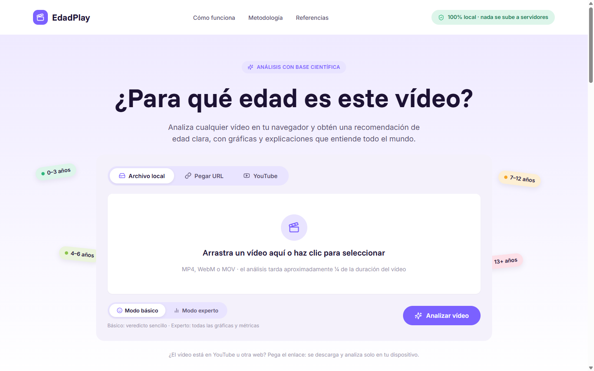
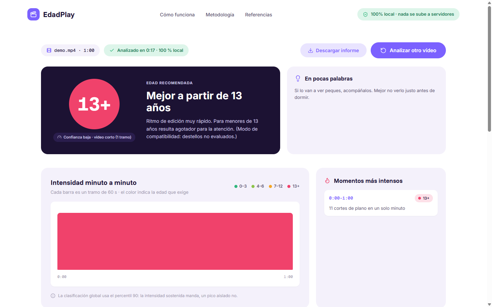

<div align="center">
  
  &nbsp;&nbsp;
  
  <h1>🎬 EdadPlay</h1>
  <p>Analyze any video in your browser and get a science-based age recommendation for children — 100% local, nothing is uploaded.</p>
  <p>
    <a href="LICENSE"></a>
    <a href="https://episuarez.github.io/edadPlay/"></a>
    
    
    <a href="https://huggingface.co/spaces/episuarez/edadplay-backend"></a>
  </p>
</div>

## Try it

Open **[episuarez.github.io/edadPlay](https://episuarez.github.io/edadPlay/)**, drop a video file (MP4, WebM, MOV) or paste a URL, and wait roughly ¼ of the video's duration. The video never leaves your device: decoding, audio analysis and scoring all run in the browser.

## What it measures

| Metric | Basis | Evidence |
|--------|-------|----------|
| **Visual cuts/min** | Shot changes via luminance-histogram correlation | Lillard & Peterson (2011); Hinten et al. (2025) meta-analysis |
| **Flashes/s** | Per-zone luminance oscillations | WCAG 2.3.1 photosensitive-seizure limit (3/s) |
| **Loudness peaks** | ITU-R BT.1770 K-weighted short-term loudness vs. programme average | EBU R128; WHO safe listening (<75 dB) |
| **Sound event density** | Salient audio onsets per minute | Christakis et al., PNAS (2018) |
| **On-screen motion** | Inter-frame luminance change within shots | Heuristic |
| **Visual complexity** | Sobel edge density | Heuristic |

The video is split into 60-second segments; each segment gets the age its strictest metric demands, and the global rating is the 90th percentile across segments — sustained intensity decides, a single outlier peak doesn't (it's listed separately as an "intense moment"). Exceeding the flash limit always raises an explicit photosensitivity warning. Full methodology with references is on the site itself.

## Features

- **Basic / expert mode** — plain verdict for parents, full charts and metrics for the curious
- **Data-driven explanations** — verdict summary, advice and tips are generated from the actual measurements, in plain Spanish
- **Per-minute timeline, intense moments, distribution donut and per-metric sparklines**
- **Downloadable report** — self-contained HTML with the full per-segment table
- **Three sources** — local file, direct video URL, or YouTube/Vimeo/TikTok/… via the optional backend
- **Private by design** — analysis is 100% client-side; the optional backend only relays bytes and stores nothing

## Project structure

```
edadPlay
├── docs/                  # Static web app (GitHub Pages)
│   ├── index.html
│   ├── css/styles.css     # Design tokens from design/desgin.pen
│   └── js/
│       ├── main.js            # UI orchestration and rendering
│       ├── insights.js        # Data-driven copy (verdict, advice, tips)
│       ├── video-analyzer.js  # Cuts, motion, complexity, flashes
│       ├── audio-analyzer.js  # BT.1770 loudness, onset detection
│       ├── scoring.js         # Age thresholds and aggregation rules
│       └── config.js          # Optional backend URL
├── backend/               # Optional download helper (Hugging Face Space)
├── design/                # Pencil (.pen) design source
└── app.py / core.py       # Legacy Streamlit version
```

## Run locally

No build step, no dependencies:

```bash
cd docs
python -m http.server 8000
# http://localhost:8000
```

## Optional backend (YouTube tab)

Streaming platforms don't allow fetching video files cross-origin, so the YouTube tab uses a small FastAPI + yt-dlp helper that streams the file to the browser (≤480p, nothing stored). It runs free on a Hugging Face Space and includes anti-bot layers for datacenter IPs: PO Token provider, Chrome TLS impersonation, client fallback chain and 12-hourly yt-dlp self-updates. Optional cookies as the last layer.

Deploy guide: [`backend/DEPLOY_HF.md`](backend/DEPLOY_HF.md). Point `docs/js/config.js` at your Space and you're done. Without a backend everything else still works.

## Contributing

See [CONTRIBUTING.md](CONTRIBUTING.md). Issues and PRs welcome — especially calibration data for the heuristic thresholds.

## License

[MIT](LICENSE) — EdadPlay is an orientation tool; it does not replace the judgement of parents or professionals.
